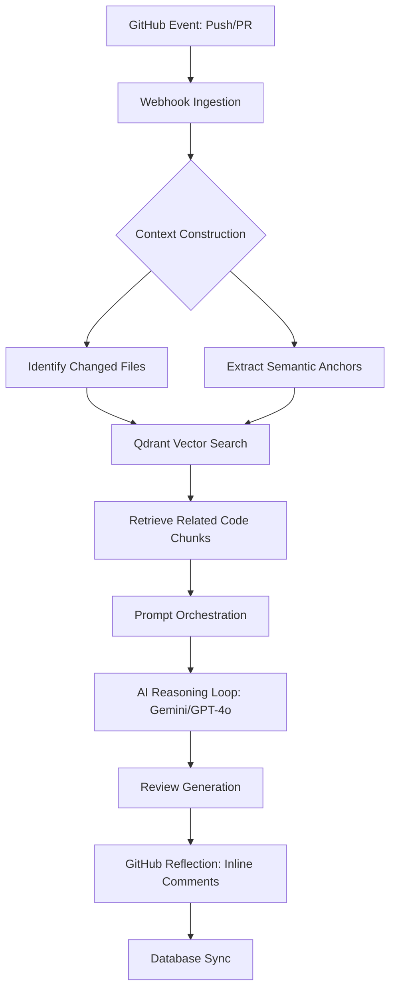

# Revio: Context-Aware AI Code Reviewer

Engineering high-quality code through semantic codebase intelligence.

Revio is a high-performance, context-aware code review agent built for modern engineering teams. It bridges the gap between rapid software delivery and maintainable code quality by leveraging advanced artificial intelligence that understands not just code, but the context in which it lives.

## Vision and Problem Statement

For modern software teams, code review process is often a significant bottleneck. Developers spend hours manually reviewing changes, leading to:

1.  Reviewer Fatigue: Critical bugs being missed due to high cognitive load.
2.  Inconsistent Quality: Different reviewers applying different standards.
3.  Slow Shipping Cycles: Code sitting in pull requests for days waiting for feedback.
4.  Technical Debt Accumulation: Incremental changes that break global architectural patterns because reviewer lacks context.

Revio solves these challenges by acting as a 24/7 intelligent reviewer that has perfect memory of your entire repository.

## Technical Architecture

Revio is designed as a modular, event-driven system. Below is a high-level representation of RAG (Retrieval-Augmented Generation) pipeline:



### Core Components

1.  **Ingestion Engine**: Extracts code from GitHub, chunks it using AST-aware dividers, and generates vector embeddings via text-embedding-3-small (or Gemini equivalent).
2.  **Vector Store (Qdrant)**: Stores high-dimensional code representations for sub-millisecond similarity searches.
3.  **Review Orchestrator**:
    - Triggered by GitHub pull_request webhooks.
    - Performs Context Retrieval: Identifies modified files and fetches semantically related code from vector store.
    - Reasoning Loop: Feeds diff + retrieved context into a high-reasoning LLM with a specialized system prompt.
4.  **Feedback Loop**: Posts results as high-fidelity GitHub inline comments or summary reviews.

## Business Value and Impact

By integrating Revio into your development workflow, organizations achieve:

1.  Faster Time-to-Market: Instant initial feedback on pull requests reduces cycle time from code completion to merge.
2.  Enhanced Code Quality: Consistent application of best practices and architectural standards.
3.  Reduced Engineering Costs: Senior developers are freed from repetitive linting-style reviews.
4.  Improved Onboarding: Intelligent code search helps new developers understand complex systems instantly.

## Product Showcase

### 1. Intelligent PR Analysis
Revio provides more than just linting. It analyzes logic, design patterns, and potential edge cases. Because it has indexed your entire codebase, it can tell you if a new change violates a pattern used elsewhere or if it duplicates an existing utility.

### 2. Custom Review Rules
Teams can define specific "rules" in dashboard. These rules are injected into the AI's reasoning loop, allowing for repo-specific enforcement of architecture (e.g., "Always use Repository pattern for database access").

### 3. Analytics Dashboard
Monitor review coverage, common security issues, and team velocity through a high-fidelity dashboard built on Next.js 15.

## Technology Stack

1.  Frontend/API: Next.js 15 (App Router, Server Actions)
2.  Runtime: Node.js 20+ (with Next.js 15 after() API)
3.  Database: PostgreSQL (Prisma ORM)
4.  Vector Intelligence: Qdrant
5.  Message Queue: BullMQ (Redis)
6.  AI Models: Google Gemini 1.5 Pro / Flash, OpenAI GPT-4o
7.  Auth and API: Octokit (GitHub App Architecture)

## Security and Privacy

Revio is built with an "Enterprise-First" mindset:

1.  Data Encryption: All access tokens and sensitive configurations are encrypted at rest using AES-256-GCM.
2.  Stateless Processing: Code diffs are processed in temporary execution contexts and never stored long-term.
3.  Private Vector Index: Each repository has an isolated namespace in our vector database, ensuring no cross-contamination of codebase data.
4.  Row Level Security (RLS): Database tables have RLS enabled to prevent unauthorized direct API access. The Next.js app uses service_role keys which bypass RLS, while direct Supabase API access is blocked.

## Review Workflow Sequence

When a pull request is detected, Revio executes the following sequence:

1.  **Context Construction**: The system identifies changed files and extracts semantic anchors (function signatures, class names, etc.).
2.  **Semantic Retrieval**: It queries Qdrant vector store to find top relevant code snippets across the entire repository.
3.  **Prompt Orchestration**: A multi-turn prompt is constructed including PR Diff, retrieved semantic context, and repository-specific review rules.
4.  **AI Inference**: The orchestrated prompt is processed by the configured LLM.
5.  **GitHub Reflection**: Feedback is mapped back to specific line numbers in the PR using a fuzzy-match coordinate system.

## Getting Started

### Prerequisites

1.  Node.js: >= 20.11.0
2.  PostgreSQL: e.g., Supabase or local instance
3.  Redis: Required for BullMQ background workers
4.  Qdrant: Local Docker instance or Qdrant Cloud

### Installation

```bash
# 1. Clone & Install
git clone https://github.com/mayurbijarniya/Revio.git && cd Revio
npm install

# 2. Infrastructure Setup
cp .env.example .env
# Edit .env with your credentials

# 3. Database & Indexing
npx prisma db push
npx prisma generate

# 4. Run Development
npm run dev
```

### Environment Variables

Configure the following keys in your .env file:

```env
DATABASE_URL="postgresql://..."
DIRECT_URL="postgresql://..."
GITHUB_APP_ID="your_github_app_id"
GITHUB_APP_CLIENT_ID="your_github_app_client_id"
GITHUB_APP_CLIENT_SECRET="your_github_app_client_secret"
GITHUB_WEBHOOK_SECRET="your_webhook_secret"
GOOGLE_AI_API_KEY="..."
QDRANT_URL="..."
QDRANT_API_KEY="..."
```

## Infrastructure and Scaling

Revio is designed to scale horizontally:

1.  **Background Workers**: For high-volume repositories, Revio uses BullMQ and Redis to manage indexing and review jobs outside of request-response cycle.
2.  **Serverless Optimization**: On platforms like Vercel, Revio uses Next.js `after()` API to ensure long-running AI tasks complete even after HTTP response is sent.
3.  **Vector Performance**: Qdrant's HNSW indexing provides logarithmic search time, ensuring that context retrieval remains fast even for million-line codebases.

## Roadmap

1.  Support for multi-repository context (system-of-systems analysis).
2.  Direct IDE integration (VS Code extension / JetBrains plugin).
3.  Integrated "Auto-Fix" suggestions (One-click PR updates).

## License

MIT © Revio
