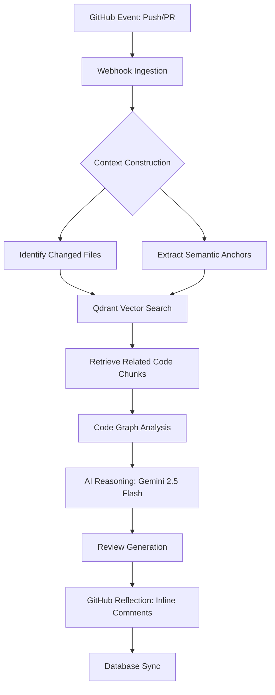

# Revio: Context-Aware AI Code Reviewer (v3.0.0)

Engineering high-quality code through semantic codebase intelligence.

---

## Development Status: Phase 4 Complete - Phase 5 Upcoming

Revio v3.0 is NOW LIVE with AI Code Intelligence! Phase 4 brought revolutionary features including graph-based analysis, confidence scoring, and the learning system.

**v3.0 Highlights:**
- Graph-Based Analysis with AST-powered code understanding
- 1-5 Star Confidence Scoring for merge readiness
- Blast Radius visualization for impact analysis
- Learning System that adapts to your team's feedback
- Interactive @revio-bot conversations in PR comments

- [x] **Phase 1**: Core Infrastructure & GitHub Integration
- [x] **Phase 2**: Vector-Based Semantic Indexing
- [x] **Phase 3**: Intelligent Review Engine & Team Analytics
- [x] **Phase 4**: Interactive Bot Conversations & Learning System *(COMPLETED)*
- [ ] **Phase 5**: Enterprise Features - SSO, Stripe Billing, Self-Hosted *(Upcoming)*

---

Revio is a high-performance, context-aware code review agent built for modern engineering teams. It bridges the gap between rapid software delivery and maintainable code quality by leveraging advanced artificial intelligence that understands not just code, but the context in which it lives.

## Vision and Problem Statement

For modern software teams, code review process is often a significant bottleneck. Developers spend hours manually reviewing changes, leading to:

1.  Reviewer Fatigue: Critical bugs being missed due to high cognitive load.
2.  Inconsistent Quality: Different reviewers applying different standards.
3.  Slow Shipping Cycles: Code sitting in pull requests for days waiting for feedback.
4.  Technical Debt Accumulation: Incremental changes that break global architectural patterns because reviewer lacks context.

Revio solves these challenges by acting as a 24/7 intelligent reviewer that has perfect memory of your entire repository.

## Technical Architecture

Revio is designed as a modular, event-driven system. Below is a high-level representation of RAG (Retrieval-Augmented Generation) pipeline:



### Core Components

1.  **Ingestion Engine**: Extracts code from GitHub, chunks it using AST-aware dividers, and generates vector embeddings via text-embedding-3-small.
2.  **Code Graph Engine**: Builds AST-based code understanding with function relationships, call paths, and dependency mapping.
3.  **Vector Store (Qdrant)**: Stores high-dimensional code representations for sub-millisecond similarity searches.
4.  **Review Orchestrator**:
    - Triggered by GitHub pull_request webhooks.
    - Performs Context Retrieval: Identifies modified files and fetches semantically related code from vector store.
    - Builds Code Graph: Maps function relationships and calculates impact radius.
    - Reasoning Loop: Feeds diff + retrieved context + graph analysis into Gemini 2.5 Flash.
5.  **Feedback Loop**: Posts results as high-fidelity GitHub inline comments or summary reviews.

## Business Value and Impact

By integrating Revio into your development workflow, organizations achieve:

1.  Faster Time-to-Market: Instant initial feedback on pull requests reduces cycle time from code completion to merge.
2.  Enhanced Code Quality: Consistent application of best practices and architectural standards.
3.  Reduced Engineering Costs: Senior developers are freed from repetitive linting-style reviews.
4.  Improved Onboarding: Intelligent code search helps new developers understand complex systems instantly.

### 1. Autonomous Code Review
Revio doesn't just scan for syntax; it understands architectural intent. By indexing your entire codebase, it can identify when a PR violates existing design patterns, duplicates logic across modules, or introduces subtle regressions that standard linters miss.

### 2. Multi-Layer Security Scanner
Equipped with a high-fidelity pattern engine, Revio automatically detects:
- **Injection Attacks**: SQLi, NoSQLi, and Command Injection.
- **Data Exposure**: XSS, hardcoded secrets, and PII leakage.
- **Weak Cryptography**: Obsolete hashing (MD5/SHA1) and insecure random number generation.
- **Configuration Risks**: Insecure CORS policies and debug mode exposure.

### 3. AI Code Intelligence (v3.0)
- **Graph-Based Analysis**: AST-powered code understanding with function relationships and call paths
- **Confidence Scoring**: 1-5 star merge readiness with multi-factor analysis (issues, security, complexity)
- **Blast Radius**: Visual impact analysis showing affected files and functions with risk-based visualization
- **Learning System**: Adapts to your team's feedback, auto-suppresses low-value noise
- **Interactive Bot**: @revio-bot conversations in PR comments for clarifications and re-reviews
- **Docstring Generation**: AI-generated JSDoc suggestions with one-click apply

### 4. Organization & Team Intelligence
- **Team Velocity**: Monitor review turnaround times and throughput across repositories.
- **Quality Hotspots**: Identify specific files or modules that frequently introduce technical debt.
- **Activity Feed**: Real-time audit log of all repository events and review findings for organization admins.

## Technology Stack

1.  Frontend/API: Next.js 15 (App Router, Server Actions)
2.  Runtime: Node.js 20+ (with Next.js 15 after() API)
3.  Database: PostgreSQL (Prisma ORM)
4.  Vector Intelligence: Qdrant
5.  Message Queue: BullMQ (Redis)
6.  AI Models: Google Gemini 2.5 Flash / Flash-Lite, OpenAI text-embedding-3-small
7.  Auth and API: GitHub App Architecture (Octokit)

## Security and Privacy

Revio is built with an "Enterprise-First" mindset:

1.  Data Encryption: All access tokens and sensitive configurations are encrypted at rest using AES-256-GCM.
2.  Stateless Processing: Code diffs are processed in temporary execution contexts and never stored long-term.
3.  Private Vector Index: Each repository has an isolated namespace in our vector database, ensuring no cross-contamination of codebase data.
4.  Row Level Security (RLS): Database tables have RLS enabled to prevent unauthorized direct API access. The Next.js app uses service_role keys which bypass RLS, while direct Supabase API access is blocked.

## Review Workflow Sequence

When a pull request is detected, Revio executes the following sequence:

1.  **Context Construction**: The system identifies changed files and extracts semantic anchors (function signatures, class names, etc.).
2.  **Code Graph Analysis**: Builds AST-based graph of function relationships, calls, and dependencies.
3.  **Semantic Retrieval**: It queries Qdrant vector store to find top relevant code snippets across the entire repository.
4.  **Impact Analysis**: Calculates blast radius - which functions and files are affected by the changes.
5.  **Prompt Orchestration**: A multi-turn prompt is constructed including PR Diff, retrieved semantic context, code graph, and repository-specific review rules.
6.  **AI Inference**: The orchestrated prompt is processed by Gemini 2.5 Flash with specialized system prompts.
7.  **Review Generation**: Generates structured review with confidence score, issues, and suggestions.
8.  **GitHub Reflection**: Feedback is mapped back to specific line numbers in the PR using a fuzzy-match coordinate system.

## Getting Started

### Prerequisites

1.  Node.js: >= 20.11.0
2.  PostgreSQL: e.g., Supabase or local instance
3.  Redis: Required for BullMQ background workers
4.  Qdrant: Local Docker instance or Qdrant Cloud

### Installation

```bash
# 1. Clone & Install
git clone https://github.com/mayurbijarniya/Revio.git && cd Revio
npm install

# 2. Infrastructure Setup
cp .env.example .env
# Edit .env with your credentials

# 3. Database & Indexing
npx prisma db push
npx prisma generate

# 4. Run Development
npm run dev
```

### Environment Variables

Configure the following keys in your .env file:

```env
DATABASE_URL="postgresql://..."
DIRECT_URL="postgresql://..."
GITHUB_APP_ID="your_github_app_id"
GITHUB_APP_CLIENT_ID="your_github_app_client_id"
GITHUB_APP_CLIENT_SECRET="your_github_app_client_secret"
GITHUB_APP_WEBHOOK_SECRET="your_webhook_secret"
GOOGLE_AI_API_KEY="..."
OPENAI_API_KEY="..."
QDRANT_URL="..."
QDRANT_API_KEY="..."
```

## Infrastructure and Scaling

Revio is designed to scale horizontally:

1.  **Background Workers**: For high-volume repositories, Revio uses BullMQ and Redis to manage indexing and review jobs outside of request-response cycle.
2.  **Serverless Optimization**: On platforms like Vercel, Revio uses Next.js `after()` API to ensure long-running AI tasks complete even after HTTP response is sent.
3.  **Vector Performance**: Qdrant's HNSW indexing provides logarithmic search time, ensuring that context retrieval remains fast even for million-line codebases.

## Production Checklist

1. Set production env vars (`DATABASE_URL`, `DIRECT_URL`, Redis/Qdrant keys, AI keys, `NEXT_PUBLIC_APP_URL`).
2. Run DB migrations: `npx prisma migrate deploy --schema prisma/schema.prisma`.
3. Create GitHub App at https://github.com/organizations/Reviooo/settings/apps/revio-bot with:
   - Repository permissions: pull_requests, issue_comments, contents
   - Webhook URL: https://your-domain.com/api/webhooks/github
4. Configure `GITHUB_APP_WEBHOOK_SECRET` in environment.
5. Smoke test: open a PR, confirm Revio posts a review, then comment `@revio-bot explain` and confirm a reply.

## Roadmap

1. [ ] **Phase 5: Enterprise Features** - Stripe billing, SSO/SAML, self-hosted Docker/K8s
2. [ ] **Auto-Fix Integration** - One-click PR updates for common issues
3. [ ] **IDE Integration** - VS Code extension and JetBrains plugin

## License

MIT © Revio
