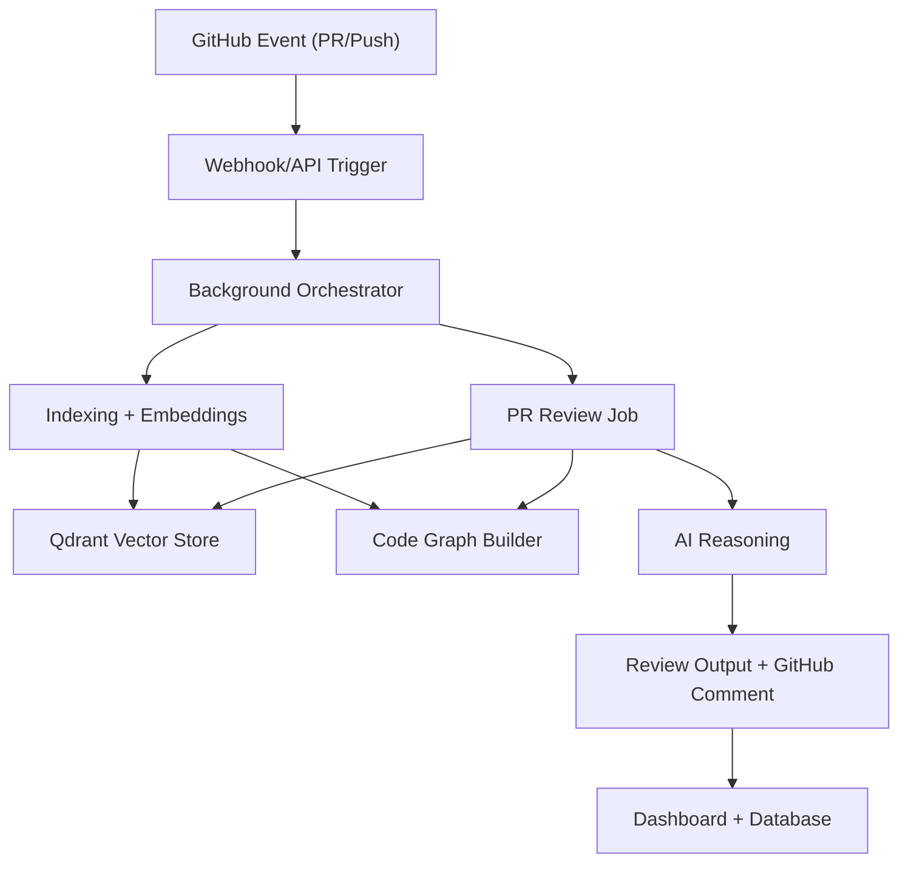

<p align="center">
  
</p>

# Revio

AI-powered code review platform for GitHub repositories.  
Revio indexes your codebase, understands structural context, and posts actionable PR feedback with risk and confidence scoring.

## Why Revio

Manual code review is slow, inconsistent, and easy to miss at scale. Revio is built to:
- catch bugs and security flaws early,
- keep review quality consistent across teams,
- reduce reviewer toil with context-aware automation,
- provide clear merge guidance (`approve` / `comment` / `request changes`).

## What You Get

- Repository indexing with semantic retrieval (vector + code graph context)
- Automated PR review on webhook events
- Manual review/re-review from dashboard
- Risk level + confidence scoring
- Security scanner integrated into review flow
- Coding standards auto-detection from repo instruction files
- Interactive review assistant (`@revio-bot`)
- Team analytics and historical trend views

## Product Surfaces

From the UI, users can:
1. Connect/disconnect GitHub repositories
2. Track indexing progress in real time (pending -> indexing -> indexed)
3. View PR review summaries and deep-dive findings
4. Trigger manual reviews and re-reviews
5. Chat with repository context
6. Configure repository review rules and ignored paths
7. Inspect organization-level analytics and activity

## High-Level Architecture



## Core Components

1. **Indexer**
   - Fetches repository tree/content through GitHub API
   - Chunks code logically and generates embeddings
   - Supports full and incremental indexing
2. **Vector Layer (Qdrant)**
   - Stores embedding chunks for semantic retrieval
   - Repository-isolated collections
3. **Code Graph Engine**
   - Builds structural graph (functions/dependencies/impact)
   - Used for blast radius and contextual reasoning
4. **Review Pipeline**
   - Combines PR diff + semantic context + graph context + security findings
   - Produces issues, suggestions, recommendation, confidence, risk
5. **Background Runtime**
   - Queue-first with worker support
   - Serverless fallback in hybrid mode

## Supported Languages (Indexing/Analysis)

- TypeScript / JavaScript
- Python
- Go
- Rust
- Java
- C++
- C#
- Ruby
- PHP
- Swift

## Review Flow

For each PR, Revio performs:
1. Diff ingestion from GitHub
2. Semantic context retrieval from vector store
3. Code graph impact analysis
4. Security scan on changed areas
5. AI review generation
6. GitHub comment/review posting
7. Dashboard persistence for tracking and analytics

## Data Lifecycle and Deletion

On repository disconnect:
- Repository-scoped records are removed from app DB (indexed files, chats, PR reviews, code graph, standards, review-learning links)
- Qdrant collection for that repository is deleted

Operational telemetry/history may remain (for platform observability), but repository content/context is removed.

## Security Posture

- GitHub auth via GitHub App/OAuth flow
- Encrypted token handling at rest (AES-256-GCM in app logic)
- Signed webhook verification
- Stateless processing-oriented architecture
- Security scanning integrated into review generation

## Tech Stack

- **Frontend/API**: Next.js 15 (App Router)
- **Runtime**: Node.js 24.x
- **Database**: PostgreSQL + Prisma
- **Vector DB**: Qdrant
- **Queue**: BullMQ + Redis
- **Integrations**: GitHub App / Octokit
- **AI Providers**: Configurable (OpenAI/Gemini usage paths in codebase)

## Getting Started

### Prerequisites

- Node.js 24.x (`nvm use` supported via `.nvmrc`)
- PostgreSQL
- Redis
- Qdrant

### Install

```bash
git clone https://github.com/mayurbijarniya/Revio.git
cd Revio
npm install
cp .env.example .env
```

### Database Setup

```bash
npx prisma db push
npx prisma generate
```

### Run App

```bash
npm run dev
```

## Environment Configuration

Use `.env.example` as source-of-truth.

Important groups:
- App/Auth: `NEXT_PUBLIC_APP_URL`, `SESSION_SECRET`, `ENCRYPTION_KEY`
- DB: `DATABASE_URL` (and `DIRECT_URL` if needed)
- GitHub: `GITHUB_APP_ID`, `GITHUB_APP_CLIENT_ID`, `GITHUB_APP_CLIENT_SECRET`, `GITHUB_APP_PRIVATE_KEY`, `GITHUB_APP_WEBHOOK_SECRET`
- AI: `GOOGLE_AI_API_KEY`, `OPENAI_API_KEY`
- Infra: `QDRANT_URL`, `QDRANT_API_KEY`, `UPSTASH_REDIS_REST_URL`, `UPSTASH_REDIS_REST_TOKEN`
- Ops: `CRON_SECRET`, `BACKGROUND_MODE`

### `BACKGROUND_MODE`

- `hybrid` (recommended): queue-first + serverless fallback
- `queue`: queue-only, requires persistent workers
- `serverless`: no queue workers required

## Worker Runtime

When using queue mode (`hybrid`/`queue`), run workers continuously:

```bash
npm run worker
```

Or split workers:

```bash
npm run worker:indexing
npm run worker:review
```

See: `docs/worker-deployment.md`

## Health Endpoints

- `GET /api/health/live`
- `GET /api/health/ready`
- `GET /api/health/deps`

## Test and Validation

```bash
npm run type-check
npm run lint
npm run test
```

## Production Checklist

1. Set production env vars
2. Run migrations:
   - `npx prisma migrate deploy --schema prisma/schema.prisma`
3. Configure GitHub App permissions (`pull_requests`, `issue_comments`, `contents`)
4. Set webhook URL:
   - `https://<your-domain>/api/webhooks/github`
5. Verify PR review flow end-to-end

## Roadmap

- Better monorepo scale and retrieval efficiency
- Auto-fix workflow support
- IDE integrations

## Contributing

Issues and PRs are welcome.

## License

MIT. See [LICENSE](./LICENSE).
